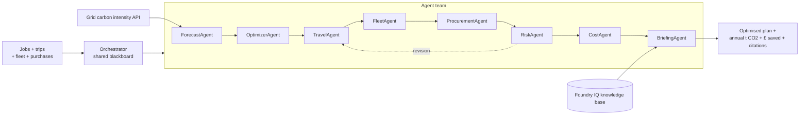

# CarbonShift 🌍⚡

**An organizational sustainability co-pilot: a team of AI agents that retime and
reroute a company's flexible operations — compute, business travel, fleet, and
procurement — to cut both carbon and cost.**

Submission for the **Agents League Hackathon** (Reasoning Agents track · Microsoft Foundry + **Foundry IQ**).

---

## The problem (a real global-warming lever)

Electricity is ~25% of global greenhouse-gas emissions, and business travel is a major
slice of most companies' footprint. The carbon intensity of the grid (grams of CO₂ per
kWh) swings **2–5× throughout the day**, and the cheapest, cleanest travel option is
rarely the default.

Yet most **flexible** activity — AI training jobs, batch work, EV charging, routine
trips, building energy use, fleet mileage, and what a company buys — happens at fixed
times and in the highest-carbon, highest-cost way.

**Simply shifting flexible work to cleaner hours and rerouting trips to lower-carbon
modes cuts emissions 20–60% and saves money — with no new hardware and no missed
deadlines.**

CarbonShift is an AI agent team that decides *when* and *how* to run each workload and
trip to minimise **CO₂ and £** while honouring every deadline and essential meeting.

## What the agent does

CarbonShift is a **team of eight specialised agents** coordinated by an orchestrator
over a shared blackboard, covering four organizational domains across the GHG Protocol
scopes. The orchestrator runs a **RiskAgent-led negotiation loop** — the RiskAgent can
send a plan back for revision before it is finalised:

1. **ForecastAgent** — fetches grid carbon intensity for the next 24–48h and rates the
   forecast confidence.
2. **OptimizerAgent** — finds the lowest-carbon window for each compute job that still
   meets its deadline, and computes kg CO₂ and £ saved.
3. **TravelAgent** — picks the lowest-carbon mode (car → EV → rail → virtual) for each
   trip, using an LLM classifier (gpt-4o grounded in Foundry IQ) to judge each trip's
   in-person need, and never replacing an essential meeting with a virtual call.
4. **FleetAgent** (Scope 1 & 3) — electrifies viable diesel/petrol vehicles against
   real EV range + charging-availability data, and leaves non-swappable ones
   (e.g. heavy haulage) unchanged.
5. **ProcurementAgent** (Scope 3) — swaps purchases to lower-carbon alternatives
   (reasoning about unfamiliar items via Foundry IQ), never touching locked
   single-source or contractual lines.
6. **RiskAgent** — an independent guardrail that re-checks every decision against hard
   constraints (deadlines, earliest-start, inflexible jobs, essential trips, and never
   increasing emissions) and approves, blocks, or sends the plan back for revision.
7. **CostAgent** — annualises and rolls every domain into a single, honest headline:
   estimated annual tonnes CO₂ avoided and £ saved, with the annualisation assumptions
   shown.
8. **BriefingAgent** — the LLM agent (gpt-4o on Microsoft Foundry) that turns the
   validated plan into a clear, cited operator briefing, **grounded by Foundry IQ**.

The agents pass typed messages to each other; the full transcript is shown in the CLI
and web UI so the reasoning is transparent.

## Request portal & time window

Beyond the team dashboard, managers submit **compute, travel, fleet, and procurement**
requests at **`/request`**. Each request gets an emailed, Foundry-IQ-grounded
recommendation with **Accept** / **Override** actions: accepted items flow onto the
dashboard with a ✦ AI marker and their saving, while overrides are flagged with a red
⚑ badge and the manager's reason. The dashboard also has a **date/time window selector**
(default: last 24 hours, live) that re-anchors the whole evaluation — grid forecast and
scheduling — to any chosen moment.

## Safety & reliability

- Hard deadlines, SLAs, and essential meetings are **never** violated; fails safe to
  "run now" / "keep in person".
- Every CO₂ and cost figure is **cited** to its source via Foundry IQ.
- Assumptions and confidence are shown with each recommendation.

## Architecture



The agents communicate by posting `AgentMessage`s on the blackboard, e.g.
`ForecastAgent → OptimizerAgent [forecast.ready]`,
`OptimizerAgent → RiskAgent [plan.proposed]`,
`TravelAgent → RiskAgent [travel.proposed]`,
`FleetAgent → RiskAgent [fleet.proposed]`,
`ProcurementAgent → RiskAgent [procurement.proposed]`,
`RiskAgent → TravelAgent [revision.requested]`,
`RiskAgent → CostAgent [safety.verdict]`,
`CostAgent → BriefingAgent [savings.rollup]`,
`BriefingAgent → user [briefing.final]`.

## Tech stack

- **Microsoft Foundry** — gpt-4o reasoning agent (Reasoning Agents track)
- **Foundry IQ** grounded retrieval (required Microsoft IQ layer, backed by Azure AI Search)
- **Multi-agent** orchestration with a RiskAgent-led negotiation loop (ForecastAgent · OptimizerAgent · TravelAgent · FleetAgent · ProcurementAgent · RiskAgent · CostAgent · BriefingAgent)
- Python 3.11+
- UK Carbon Intensity API (no key) for live grid data
- Flask web UI (agent transcript + before/after schedule + CO₂ & £ saved counters + travel routing + fleet/procurement cards + a manager request portal and a date/time window selector)

## Getting started

```powershell
python -m venv .venv
.\.venv\Scripts\Activate.ps1
pip install -r requirements.txt
copy .env.example .env   # then fill in your Foundry endpoint + deployment
python -m carbonshift.cli --demo
```

Then launch the web dashboard:

```powershell
python run_web.py   # open http://127.0.0.1:5000
```

## Connecting your organization's data

CarbonShift reads from three live sources, each with a safe fallback so the demo always
runs:

| Domain | Live source | Env var | Fallback |
| --- | --- | --- | --- |
| Grid carbon | UK Carbon Intensity API | `CARBON_API_BASE` | synthetic curve |
| Compute jobs | Org scheduler / batch queue (Airflow, K8s CronJobs, Slurm, …) | `JOBS_API` (+ `JOBS_API_TOKEN`) | bundled demo jobs |
| Business travel | Org travel app (SAP Concur, TravelPerk, Egencia, …) | `TRAVEL_APP_API` (+ `TRAVEL_APP_TOKEN`) | bundled demo trips |

Each connector maps the org's JSON to a `Job`/`Trip`, and the CLI and dashboard show a
**source label** so it is transparent where the data came from.

Expected payloads (a JSON list, or `{"jobs": [...]}` / `{"bookings": [...]}`):

```jsonc
// JOBS_API item
{ "name": "Nightly fine-tune", "power_kw": 120, "duration_hours": 4,
  "deadline_hours": 14, "earliest_start_hours": 0, "flexible": true }

// TRAVEL_APP_API item
{ "name": "Quarterly review, London", "distance_km": 320, "mode": "car_petrol",
  "passengers": 1, "round_trip": true, "essential": false }
```

### Try the live path with the bundled mock

```powershell
# terminal 1 — stands in for the org travel app + scheduler
python scripts/mock_org_api.py

# terminal 2 — point CarbonShift at it
$env:TRAVEL_APP_API="http://127.0.0.1:8077/travel/bookings"
$env:JOBS_API="http://127.0.0.1:8077/scheduler/jobs"
python run_web.py   # dashboard now shows "Source: scheduler:" / "travel-app:"
```

## Disclaimer


CarbonShift is a decision-support tool for the Agents League Hackathon. It contains no
confidential information. CO₂ estimates are approximate and depend on third-party grid
data.
